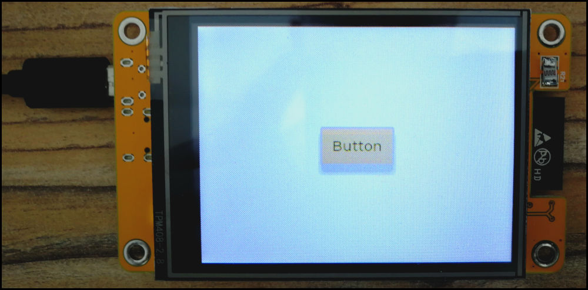

# CYD2-MPY-LVGL

## Introduction

The [Cheap Yellow Display](https://github.com/witnessmenow/ESP32-Cheap-Yellow-Display/tree/main) (CYD) is a low-cost device comprised of a ESP32-WROOM equipped with a
ILI9431 2.4' Display and a xpt2046 touch pad and some more peripherals. I ordered it on AliExpress for 6,19$.

[Two similar versions of CYD are available](https://github.com/witnessmenow/ESP32-Cheap-Yellow-Display/blob/main/cyd.md). The first version has one USB port (i call this "CYD") and the second version
features two USB ports (i call this "CYD-2"). Although the remaining components are identical, there seems to be a difference in the
display driver.

Unfortunately, I ordered the version with two USB ports and the [available demo](https://github.com/witnessmenow/ESP32-Cheap-Yellow-Display/blob/main/Examples/Micropython/demo.py) is written for the one-port CYD.
Therefore, spent a lot of time getting CYD-2 to work with Micropython firmware.

## CYD2 and MicroPython

The standard release of ESP32 MPY-Firmware can be installed on the CYD-2 as described [here](https://github.com/witnessmenow/ESP32-Cheap-Yellow-Display/blob/main/Examples/Micropython/Micropython.md).
The ILI9431 and xpt2046 drivers are also linked on the site.

A working demo and the drivers can be found in the `/mpy` folder.
The folder also contains a PinMap. The demo and the PinMap is based on [this demo](https://github.com/witnessmenow/ESP32-Cheap-Yellow-Display/blob/main/Examples/Micropython/demo.py).

## LVGL + MPY

After getting CYD2 to work with standard MPY firmware and the corresponding drivers,
I figured that the display driver is slow and has very limited capabilities for use.

Therefore, I tried to get [MicroPython LVGL](https://github.com/lvgl/lv_micropython) to work on this display.
Fortunately, a [prebuild version of the lvgl firmware](https://stefan.box2code.de/2023/11/18/esp32-grafik-mit-lvgl-und-micropython/) is provided for download by Stefan Scholz.
A modified xpt2046 driver is required and it is available for download on the same site.

Again, it cost me a lot of time to get a working demo.
It can found in the `/lvgl-mpy` folder.

The prebuild version of the MPY-LVGL firmware and the modified xpt2046 driver need to be downloaded
from the aforementioned site. I didn't upload them since I don't hold the copyright.

### Remaining Issues
I couldn't solve the remaining issues yet:
- The display brightness is notably lower when I use the LVGL firmware compared to the bare MicroPython firmware and drivers
- Colors are inverted, since I can't activate bgr-color mode in LVGL firmware

## Links
https://github.com/witnessmenow/ESP32-Cheap-Yellow-Display/blob/main/Examples/Micropython/Micropython.md
https://github.com/witnessmenow/ESP32-Cheap-Yellow-Display/blob/main/cyd.md
https://github.com/witnessmenow/ESP32-Cheap-Yellow-Display/tree/main

https://stefan.box2code.de/2023/11/18/esp32-grafik-mit-lvgl-und-micropython/
