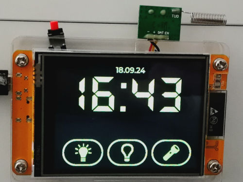
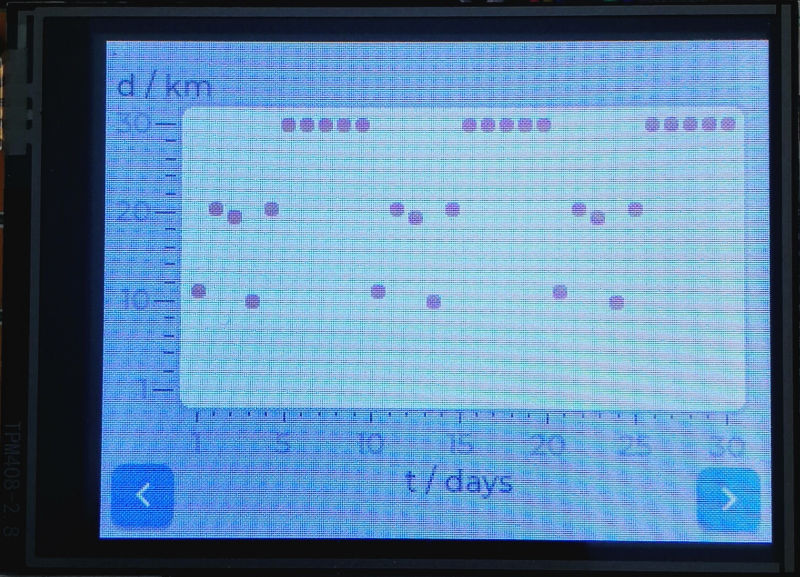
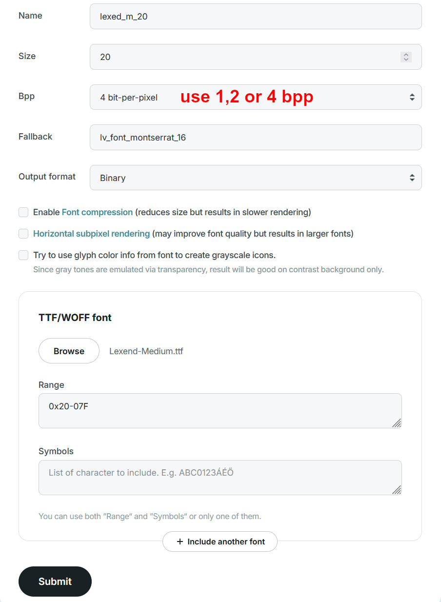
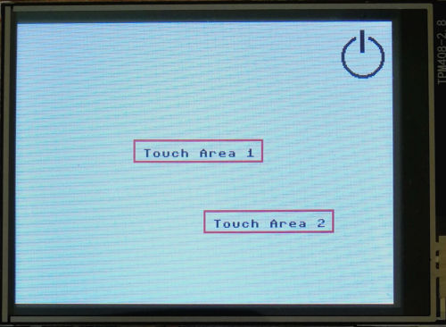

> [!NOTE]
> This repositry is meant to show you how to quickly get LVGL under Micropython on the Cheap-Yellow-Display working and save you some time and pain.
> Everyone is welcome to contribute to this repositry and share his / her knowledge.

> [!WARNING]
> All demo programs were tested with the prebuild firmware linked in this repositry using **LVGL version 8.3.6.** and **Micropython version 1.19.1.**
> The demo programs may be incompatible with other versions of LVGL / MPY.


# CYD2-MPY-LVGL

## Introduction


The [Cheap Yellow Display](https://github.com/witnessmenow/ESP32-Cheap-Yellow-Display/tree/main) (CYD) aka ESP32-2432S028 is a low-cost device comprised of a ESP32-WROOM equipped with a
ILI9431 2.8' Display and a xpt2046 resistive touch pad and some more peripherals. It can be found on AliExpress for 7$ - 15$ depending on the seller and available promotions.
In my opinion, this combination is great for GUI development for small IOT projects.


However, getting LVGL + MPY to work on the CYD(2) was very time-consuming and annoying. 
This documentation might save you a lot of time which I wasted.

**This repository is about running LVGL under Miropython firmware on the cheap yellow display.** 
This setup enables the use of Thonny to create and debug programms easily.
The CYD is ideal for small IOT projects and LVGL provides a convenient solution to create user interfaces.

The demo programms demonstrate the following functions of lvgl on CYD(2):

- simple demo with buttons and callback functions
- using CYD2 in portrait mode
- loading a png image
- loading a custom text font
- loading a custom icon font
- advanced demo with multiple screens, a chart with data imported from a .csv file and asyncio usage

[Two similar versions of CYD are available](https://github.com/witnessmenow/ESP32-Cheap-Yellow-Display/blob/main/cyd.md). 
The first version has one USB port (i call this "CYD") and the second version features two USB ports (i call this "CYD-2"). 
Although the remaining components are identical, there is a difference in the display drivers color management.




## CYD2 and LVGL + Micropython

> [!IMPORTANT]
> Summary of the steps needed to make the LVGL demo programms work on your CYD/CYD2:
> - Download the LVGL-MPY firmware from the link below and flash it to your CYD using esptool.py.
> - Upload the complete content of the `/demo-lvgl` folder to your CYD's root (not the folder itself).
> - Run demo programm (which most likely looks wrong at this point).
> - Open `demo_lvgl/lib/display_driver.py` and adjust display color mode and rotation settings (you have to test the different settings until you find the correct ones).


### Drivers and Firmware
After getting CYD2 to work with standard MPY firmware and the corresponding drivers,
I figured that the display driver is slow and has very limited capabilities for use.

A [prebuild version of the lvgl firmware 8.3.6. for CYD](https://stefan.box2code.de/2023/11/18/esp32-grafik-mit-lvgl-und-micropython/) is provided for download by Stefan Scholz in his awesome blog post.
Furthermore, Stefan Scholz modified the xpt2046 driver used in his blog.
I further modified the driver to support portrait mode (included in the `lvgl_demo/lib folder`).

The prebuild version of the MPY-LVGL firmware needs to be downloaded from the aforementioned site. 
I didn't upload them since I don't hold the copyright.

Here are direct download links from Stefan's Blog for non-german users (use one of the first three versions for CYD/CYD2):

- [Esp32WROOM](https://stefan.box2code.de/wp-content/uploads/2023/11/lv_micropython-WROOM.zip) 
- [Esp32WROOM + espnow](https://stefan.box2code.de/wp-content/uploads/2024/04/lv_micropython-WROOM_EspNow.zip)
- [Esp32WROOM + async espnow](https://stefan.box2code.de/wp-content/uploads/2024/04/lv_micropython-WROOM_AOIEspNow.zip)
- [Esp32WROVER](https://stefan.box2code.de/huge_files/lv_micropython-WROVER.zip)

The .zip archives already contain a `flash.sh` file for flashing with esptool.py under unix (i guess).
You might need to change `python` to `python3` and `-p /dev/ttyUSB0` to `--port COMXX` (XX = your COM address) if you use esptool.py with windows command line.
Open command line and navigate to the folder containing the source files (use the `cd` command, e. g. `cd Desktop/lv_micropython-WROOM`).
Then run the esptool command.
In my case I had to use the following command:
```
python -m esptool --chip esp32 --port COM13 -b 460800 --before=default_reset --after=hard_reset write_flash --flash_mode dio --flash_freq 80m --flash_size 4MB 0x1000 bootloader/bootloader.bin 0x10000 micropython.bin 0x8000 partition_table/partition-table.bin 
```

### Adjusting the display settings for CYD2

Although my CYD2's look all the same, some require adjustments for the initialization of the display driver (thanks to Stefan Scholz for the help).
Some of my boards only needed the colormode to be changed, other also required different rotation settings.
You just have to figure it out by trying.

Open `demo_lvgl/lib/display_driver.py` and look for the display initialization command:

```python
disp = ili9XXX.ili9341(clk=14, cs=15, dc=2, rst=12, power=23, miso=12, mosi=13, width = 320, height = 240,
rot = 0xC0, colormode=ili9XXX.COLOR_MODE_RGB, double_buffer = False, factor = 16)
```

If your colors are inverted, replace `colormode=ili9XXX.COLOR_MODE_RGB` with `colormode=ili9XXX.COLOR_MODE_BGR`.
If the rotation is wrong, change `rot = 0xC0` to `rot = 0xXX` according to the table below. 
Try the different values until you get the right one.

```python
# Excerpt from the ILI9341 driver MADCTL configurations for rotation and mirroring.
# First value stands for mirroring, second value stands for rotation.
MIRROR_ROTATE = {
    (False, 0): 0x80, 
    (False, 90): 0xE0,
    (False, 180): 0x40,
    (False, 270): 0x20,
    (True, 0): 0xC0,
    (True, 90): 0x60,
    (True, 180): 0x00,
    (True, 270): 0xA0
}
```
### Demo Programms

Several demos can be found in the `/demo-lvgl` folder. Flash the prebuild firmware with esptool.py and **upload the complete content** of the `/demo-lvgl` folder to your CYD (not the folder itself).
The modified xpt2046 driver is included in the `lib` folder. Display and touchscreen are initialized in the `display_driver.py` file in the `lib` folder.


The demo programms demonstrate the following functions of lvgl on CYD(2):

- simple demo with buttons and callback functions
- using CYD2 in portrait mode
- loading a png image
- loading a custom text font
- loading a custom icon font
- advanced demo with multiple screens, a chart with data imported from a .csv file and asyncio usage

## LVGL Tips

### Font Converter

Use the [font converter](https://lvgl.io/tools/fontconverter) to compile custom fonts for LVGL. 
The image shows the settings used to compile fonts and load them in the demo script (click to enlarge).





## CYD2 and MicroPython

### Drivers and Firmware

The standard release of ESP32 MPY-Firmware can be installed on the CYD-2 as described [here](https://github.com/witnessmenow/ESP32-Cheap-Yellow-Display/blob/main/Examples/Micropython/Micropython.md).
The ILI9341 driver and the xpt2046 driver can be found in the `/demo_no_lvgl` folder. 

### Color Mode for CYD2

During display initialization in pure Micropython, bgr-mode needs to be disabled:
```python
Display(self.spi_display, dc=Pin(2), cs=Pin(15), rst=Pin(15), width = 320, height = 240, bgr = False)
```

### Demo Programm

A working demo and the drivers can be found in the `/demo_no_lvgl` folder. 
Draw functions can be used and touch actions can be assigned to multiple areas on screen in the demo programm.


