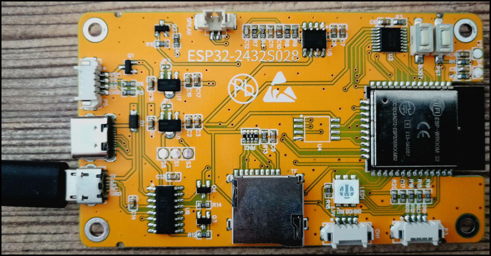
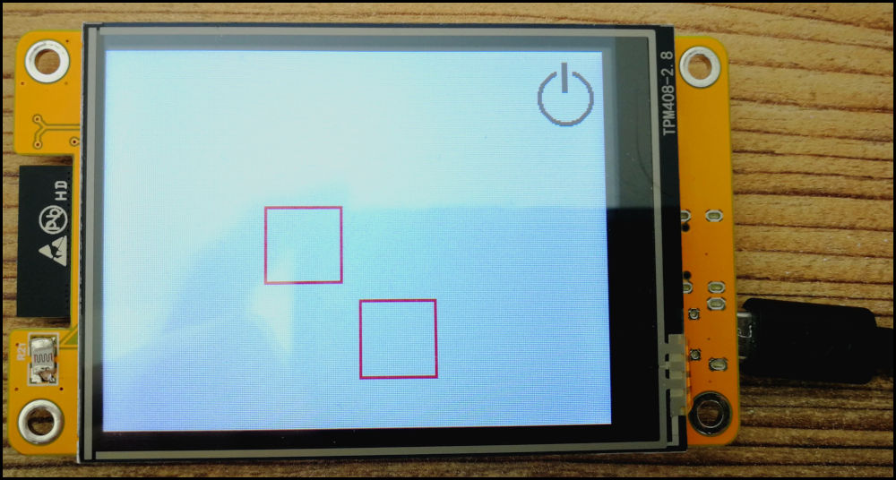

# CYD2-MPY-LVGL

## Introduction


The [Cheap Yellow Display](https://github.com/witnessmenow/ESP32-Cheap-Yellow-Display/tree/main) (CYD) is a low-cost device comprised of a ESP32-WROOM equipped with a
ILI9431 2.4' Display and a xpt2046 touch pad and some more peripherals. It can be found on AliExpress for 7$ - 15$ depending on the seller and available promotions.

This repository is about running LVGL under Miropython firmware on the cheap yellow display. This setup enables the use of Thonny to create and debug programms easily.
The CYD is ideal for small IOT projects and LVGL provides a convenient solution to create user interfaces.

[Two similar versions of CYD are available](https://github.com/witnessmenow/ESP32-Cheap-Yellow-Display/blob/main/cyd.md). 
The first version has one USB port (i call this "CYD") and the second version features two USB ports (i call this "CYD-2"). 
Although the remaining components are identical, there is a difference in the display drivers color management.


## CYD2 and LVGL + Micropython

### Drivers and Firmware
After getting CYD2 to work with standard MPY firmware and the corresponding drivers,
I figured that the display driver is slow and has very limited capabilities for use.

A [prebuild version of the lvgl firmware 8.3.6. for CYD](https://stefan.box2code.de/2023/11/18/esp32-grafik-mit-lvgl-und-micropython/) is provided for download by Stefan Scholz.
Furthermore, a modified xpt2046 driver is required and it is available for download on the same site.
I further modified the driver to support portrait mode.

The prebuild version of the MPY-LVGL firmware and the modified xpt2046 driver need to be downloaded
from the aforementioned site. I didn't upload them since I don't hold the copyright.


### Color Mode for CYD2

When using LVGL on CYD2, the colormode needs to be set during initialization of the display driver (thanks to Stefan Scholz for the help).

```python
disp = ili9XXX.ili9341(clk=14, cs=15, dc=2, rst=12, power=23, miso=12, mosi=13, width = 320, height = 240,
rot = 0xC0, colormode=ili9XXX.COLOR_MODE_RGB, double_buffer = False, factor = 16)
```


### Demo Programms

Several demos can be found in the `/lvgl-mpy` folder.


## CYD2 and MicroPython

### Drivers and Firmware


The standard release of ESP32 MPY-Firmware can be installed on the CYD-2 as described [here](https://github.com/witnessmenow/ESP32-Cheap-Yellow-Display/blob/main/Examples/Micropython/Micropython.md).
The ILI9341 driver and the xpt2046 driver can be found in the `/mpy` folder. 

### Color Mode for CYD2

During display initialization in pure Micropython, bgr-mode needs to be disabled:
```python
Display(self.spi_display, dc=Pin(2), cs=Pin(15), rst=Pin(15), width = 320, height = 240, bgr = False)
```

### Demo Programm

A working demo and the drivers can be found in the `/mpy` folder. 
Draw functions can be used and touch actions can be assigned to multiple areas on screen in the demo programm.
